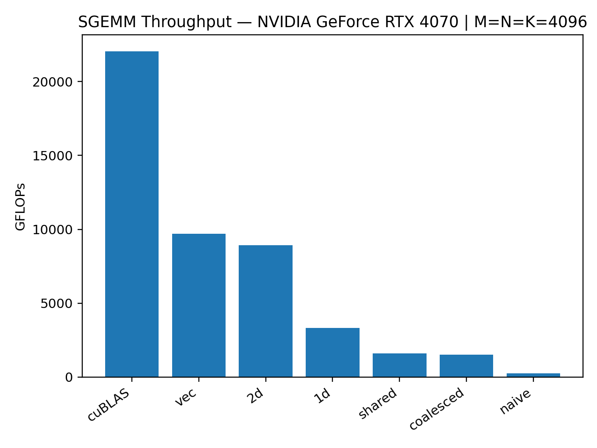
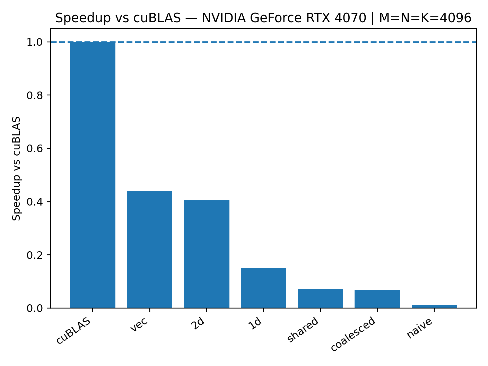
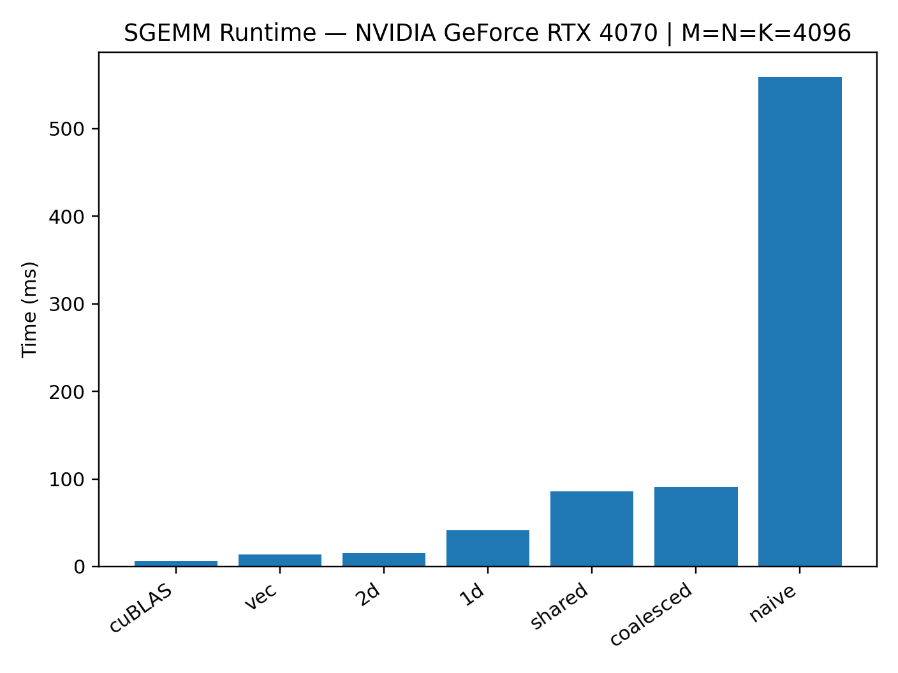

## Benchmarks (SGEMM)

**GPU:** NVIDIA GeForce RTX 4070  
**Shape:** M=N=K=4096, FP32  
**Baseline:** cuBLAS (CUBLAS_DEFAULT_MATH)

### Throughput (GFLOPs)

### Speedup vs cuBLAS

### Runtime (ms)

### Top kernels
| kernel    |        ms |    gflops |   pct_of_cublas |
|:----------|----------:|----------:|----------------:|
| cuBLAS    |   6.23215 | 22053.2   |       100       |
| vec       |  14.1554  |  9709.29  |        44.0266  |
| 2d        |  15.3913  |  8929.64  |        40.4913  |
| 1d        |  41.2412  |  3332.56  |        15.1114  |
| shared    |  85.7366  |  1603.04  |         7.26895 |
| coalesced |  90.5811  |  1517.3   |         6.88018 |
| naive     | 558.88    |   245.919 |         1.11511 |  

NOTE: This is still unfinished

TODOs:
- bank conflicts using swizzle
- bank conflicts using padding
- autotuning
- warptiling
- profiling for these addons

Goal of project:  
To deeply understand some of the most important utilizations of GPU kernels through optimizing matrix multiplication 

I offer my highest gratitude and acknowledgements to Simon Boehm for providing the worklog that allowed me to learn all this content. 
https://siboehm.com/articles/22/CUDA-MMM
